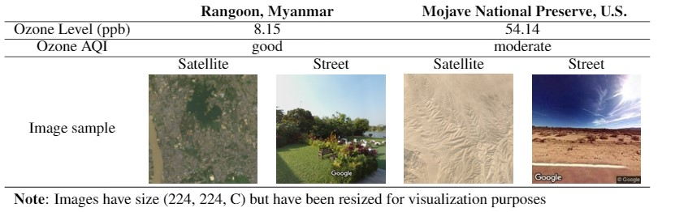
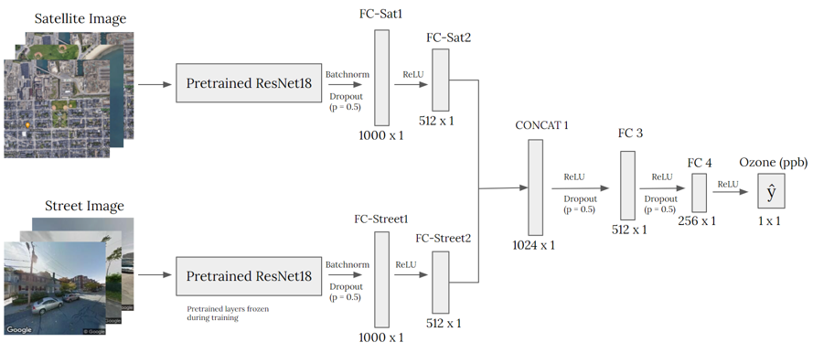

# Using satellite and street level images to predict urban emissions
**Authors: Nina Prakash, Nicolas Suarez & Andrea Vallebueno**

This was our class project for Stanford CS230 "Deep Learning" class during the Winter 2021 quarter. The project was featured as one of the [Outstanding projects for the Winter 2021 quarter](https://cs230.stanford.edu/past-projects/#winter-2021). You can find our final report [here](http://cs230.stanford.edu/projects_winter_2021/reports/70701113.pdf).

## Description
This project examines the relationship between the level of ozone concentration
in urban locations and their physical features through the use of Convolutional
Neural Networks (CNNs). We train two models, including one trained on satellite
imagery ("Satellite CNN") to capture higher-level features such as the location's 
geography, and the other trained on street-level imagery ("Street CNN") to learn
ground-level features such as motor vehicle activity. These features are then 
concatenated to train neural network ("Concat NN") on this shared representation
 and predict the location's level of ozone as measured in parts per billion. 

## Data
We obtained ozone measurements (parts per billion) for 12,976 semi-unique locations with ozone levels information mostly located in North America from [AirNow](https://www.airnow.gov/).

Our satellite imagery dataset was constructed using the Google Earth Engine API: for each location labeled with an ozone reading, we retrieve one satellite image centered at that location from the Landsat 8 Surface Reflectance Tier 1 Collection with a resolution of 224 $\times$ 224 pixels which represents $6.72$ km $\times$ $6.72$ km.  We use 7 bands from this collection: RGB, ultra blue, near infrared, and two shortwave infrared bands. We preprocess each of our images by adding a cloud mask per pixel and then computing the per pixel and band mean composite of all the available images for the year 2020.

The street-level imagery dataset was constructed using the Google Maps Street View API. For each location labeled with an ozone level, we randomly sample 10 geospatial points within $6.72$ km from the measurement point.

Here we can see some examples from our dataset:

  

## Network architecture
We train the two CNNs separately on the satellite and street-level imagery, both using a ResNet-18 architecture implemented in PyTorch and pretrained on the ImageNet dataset. The models are trained separately as the nature of the features they need to learn to associate with ozone concentration is quite different for each dataset. Transfer learning is used for both CNNs to leverage lower-level features learned on the ImageNet dataset. The ResNet-18 architecture was slightly adapted for our particular task; in the case of the satellite imagery, the CNN's input layer was modified to accommodate for the image's seven channels and was initialized using Kaiming initialization.

After training both CNNs separately to predict the ozone reading for each location, we extract $512$ features for each satellite and each street image. These are concatenated to create a feature vector of size $1,024$ representing the satellite image and a particular street view of a given location. We then train a Concatenated Feedforward Neural Network (NN) using these multiple representations of each location to predict the location's average ozone level in 2020. 

  

More details about regularization, the tuning process of hyperparameters and training of the network can be found in the report.

## Results
After tuning our hyperparameters and training our models, we obtain the following performance (Root Mean Square Error in our test set):

 |               | Satellite Model | Street-level Model | Concatenated Model |
 |:-------------:|:-------------:|:-------------:|:-------------:|
 |Test RMSE (ppb) | 12.48  |20.64 |11.70|

## Code structure
* The `02_Scripts/` directory comprises the code to scrape and preprocess
the ozone concentration data, which is sourced from the 
[AirNow API](https://docs.airnowapi.org/). It also contains a 
`01_Data_Exploration` directory which includes code to visualize elements
of the dataset such as particular data points and a geographical distribution
of the locations with ozone readings.

* In "imagery" we find the scripts to retrieve satellite imagery from Google 
Earth Engine (`imagery/getting_imagery_no_mask.py`) and the street level images 
from Google Street View (training set is build with 
`imagery/get_street_imagery_train_set.py` and .... ). The script 
`visualization_L8SR` provides functionality to visualize a Landsat 8 satellite 
image.

* The `Models` directory comprises `CNNs.py`, which implements the CNNs
used for training. We use a ResNet-18 model for both the satellite and the
street-level imagery, pretrained on the ImageNet dataset. Adjustments include
modification of the input layer to accommodate for higher image channels in the
satellite dataset (7), additional regularization through the use of
`Fully Connected -> Batchnormalization -> Dropout` blocks in the highest layers,
and modification of the final layer's number of units to fit our regression and
classification tasks. The `data_loaders.py` script includes the `SatelliteData`
and `StreetData` classes implemented to user Torch's DataLoaders. The
DataLoaders call upon the functions in `build_dataset.py` to build the
train/dev/test splits for the satellite data if not already generated.

* `train.py`, `evaluate.py` and `search_hyperparams.py` implement the code
to train our models. It is important to note that this training code has been 
largely adapted from Stanford CS 230's Computer Vision project code examples 
found at [this link](https://github.com/cs230-stanford/cs230-code-examples).

* `extract_features` loads the Satellite CNN and Street CNN with a chosen set
of weights, extracts features for each satellite and street image from the 
next to last linear layer of the model, concatenates the features and saves them
to a new set of train/dev/test files in HDF5 format.

* `predict` Using a set of chosen weights for the Concat NN, this script 
predicts the ozone measurement for a (satellite image, street image) pair of
concatenated features. 

* `error_analysis` Given a set of predictions on the concatenated features 
(generated by `predict.py`), this script performs quantitative and qualitative
analyses of the errors, their distributions and their geographic dynamics.

* `utils.py` implements helper classes and functions used to log our model
training process, load and write dictionaries, and plot learning loss curves.
